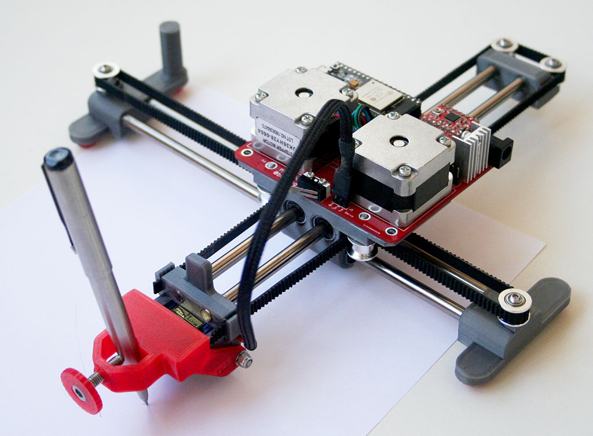
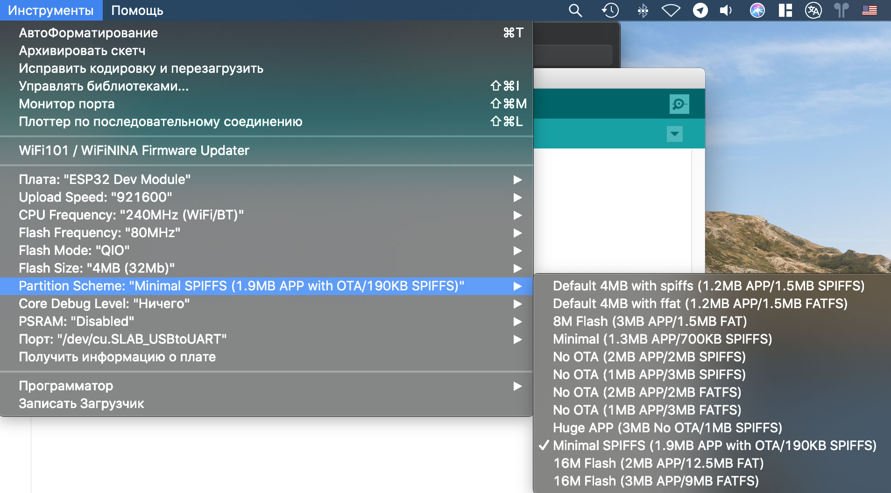
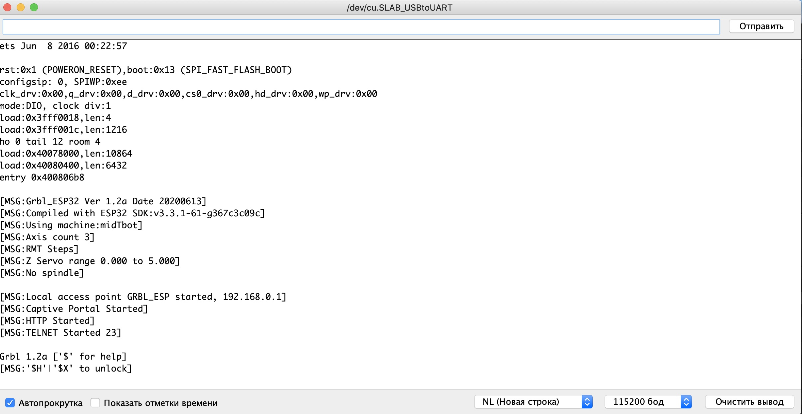
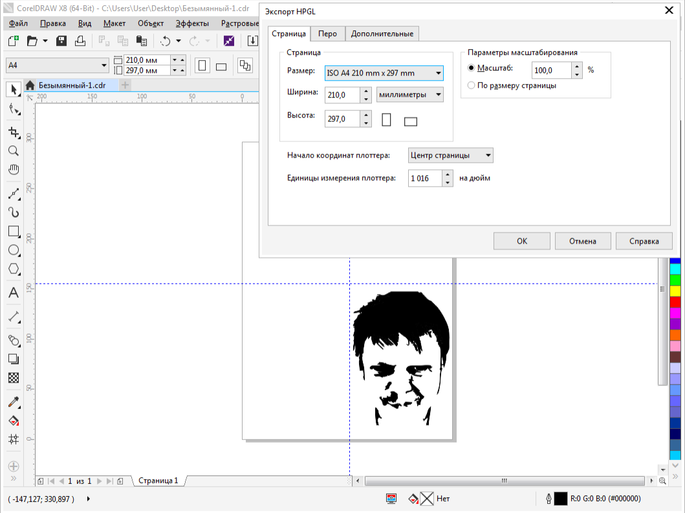
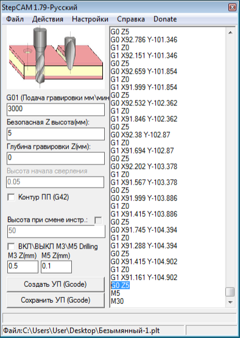
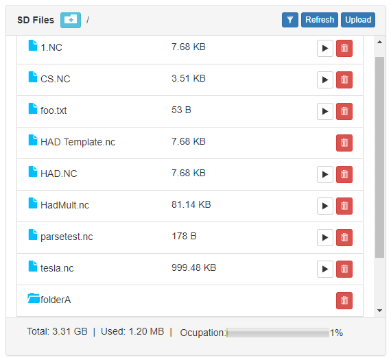

MidTBot на ESP32
================

Простой перьевой плоттер на прошивке GRBL и плате ESP32. Этот репозиторий является выжимкой по сборке и настройке. Почитать подробнее можно на [тут](https://github.com/bdring/midTbot_esp32).



## BOM:

###### PCB

|Name|Desc|Qty
|---|---|---
|C1,C2|Capacitor, Electrolytic 47uF 35V|2
|C3,C4|Capacitor MLCC 10uF 50V|2
|J1|DC Barrel Jack|1
|J2,J4|Header Male 1x4|2
|J3|Micro SD Socket TF-01A|1
|J5,J6|Header Male 1x3|2
|PS1|5VDC 1A Power Supply|1
|S1,S2|Microswitch Switch|2
|U1,U2|Header, Feamle 1x8|4
|U3|Header Female 1x19 (FYI: trimming a 1x20 works)|2
||**Required Modules**|
||StepStick A4988|2
||ESP32 Dev Kit (0.9" Wide Type)|1

###### Mechanical Parts List

|Name|Qty
|---|---
|Linear Bearing Shaft 6mm Dia. x 200 lg.|4
|Linear Bearing LM6LUU (wide Style)|4
|Pulley GT2 16Tooth 6mm 5mm Shaft|2
|Smooth Idler Pulley 3mm I.D. 16Tooth Dia 13mm Flange Dia|6
|Stepper Motor NEMA14 x 20mm Tall 5mm Shaft|2
|GT2 6mm Wide Belt|1m
|Button Screw M3 x 50mm|1
|Hex Nut M3 Locking|1
|Socket Head Screw M5 x 14|1
|Socket Head Screw M3 x 16|6
|Button Head Screw M3 x 8mm|6
|Bearing 3mm x 7mm x 3mm (683ZZ)|2
|Hobby Servo MG90S|1

## Прошивка в Arduino IDE

- При первой заливке скетча Grbl_Esp32 в ESP32 убедитесь, что он не вставлен в плату плоттера!
- В терминале Mac OS устанавливаем поддержку плат ESP32 (в репозитории автора есть информация для установки на другие операционные системы):

  ```
  mkdir -p ~/Documents/Arduino/hardware/espressif && \
  cd ~/Documents/Arduino/hardware/espressif && \
  git clone https://github.com/espressif/arduino-esp32.git esp32 && \
  cd esp32 && \
  git submodule update --init --recursive && \
  cd tools && \
  python get.py 
  ```
- Выбираем плату **ESP32 Dev Module** и схему **Minimal SPIFFS (1.9MB APP с OTA / 190KB SPIFFS)** в меню "Инструменты":



- Компилируем **Grbl\_Esp32/Grbl\_Esp32.ino**
- Загружаем. При появлении ```Connecting........``` нужно удерживать кнопку "BOOT" на плате ESP32. При нормальной загрузке должно быть: ```Leaving... Hard resetting via RTS pin...```
- Проверяем настройки в "Мониторе порта". Нажимаем RESET на плате и видим:



## Настройка моторов

- MidTbot использует механику CoreXY (всегда задействованы оба мотора). Если ось движется в неправильном направлении, то ставим настройку для X и Y ```$3 = 4``` или ```$3 = 0``` или разворачиваем разъем на 180 градусов
- Сбрасываем по умолчанию ```$rst = $```
- Проверка направления моторов: ```G91 G0X2 G0Y2```
- Проверка на парковку: ```$H```
- Установка тока двигателя для мотора **JK35HY28-0504** (0,5A): 

A4988:

```
Vref = Current Limit * 8 * 0,100(RS) = 0,5 / 1,25 = 0,4V
```

DRV8825 (на 70%):

```
Vref = Imax / 2 = 0,7 * 0,5 / 2 = 0,18V
```

## Настройка Pen Servo

- По команде ```G0Z5``` сервопривод должен переместиться вверх и по ```G0Z0``` вниз (перо на бумаге). Сервопривод должен вращаться по часовой стрелке, чтобы поднять ручку, и против часовой стрелки, чтобы опустить ее
- Можно отрегулировать конечные точки, изменив значения ```$102``` (для Z0) и ```$132``` (для Z5). Значение по умолчанию для каждого - ```100```, что соответствует 100%. Настройка ```$102 = 110``` добавит 10%. Настройка ```$102 = 90``` вычтет 10%
- Команда ```G10L2P0Z-5``` через консоль установит Z5, когда Z равна 0 (делается один раз, сохраняется во флэш-память).

## WebUI (Wi-Fi)

При первом включении будет создана точка доступа Wi-Fi со следующими настройками:

- SSID: ```GRBL_ESP```
- Пароль: ```12345678```
- IP-адрес : ```192.168.0.1```

Нужно подключится и загрузить файл данных ```Grbl_Esp32/data/index.html.gz```, содержащий веб-интерфейс.

Если скомпилировали прошивку с помощью ```ENABLE_AUTHENTIFICATION``` в ```config.h```, WebUI будет иметь двух пользователей с именами "admin" и "user". Если входим как "admin/admin", то  можем изменить любой параметр. Если вы вошли как "user/user", можем взаимодействовать только с Grbl. (Имена пользователей и пароли можно настроить перед компиляцией, отредактировав config.h).

Далее в **WebUI** нужно настроить как Wi-Fi клиент, а не точка доступа.

## Bluetooth

Как настроить написано тут: https://github.com/bdring/Grbl_Esp32/wiki/Using-Bluetooth

## Создание G-Code

Есть довольно популярная программа **InkScape** с плагином для генерации G-Code, но я привык рисовать в **CorelDraw**.

|                          | Скрин
|--------------------------|-----------------------------
| Рисуем в **CorelDraw** и экспортируем в HPGL. Для данного плоттера начало координат в центре страницы. От нее и располагаем рисунок   | 
| С помощью программы **StepCAM** получаем G-Code. Не забываем добавить в конце коанду ```G0Z5``` для поднятия пера после завершения | 
| Закидываем файл на карту памяти и в **WebUI** выбираем его для печати | 

## Контакты

GitHub автора: [https://github.com/bdring/midTbot_esp32](https://github.com/bdring/midTbot_esp32)

Grbl Esp32: [https://github.com/bdring/Grbl_Esp32](https://github.com/bdring/Grbl_Esp32)

Связаться со мной: info@dementiev.net